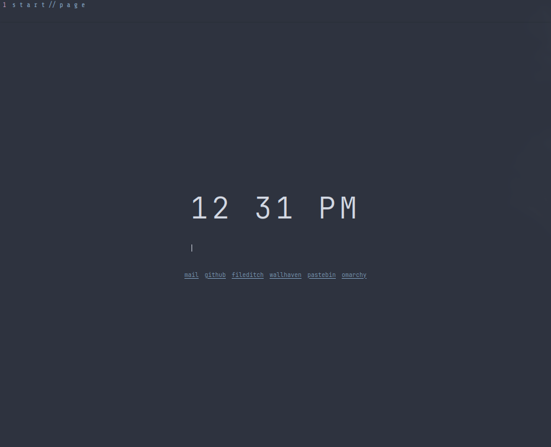

# T.W.I.S.T.
## Theme-aware Web Interface Styling Toolkit

 

This system will create a minimalist Firefox setup and a start page that you can configure with all of your favorite links and search engine. 

Dependencies: `a web browser` (for the start page), `firefox` specifically if you intend to utilize the `userChrome.css` generator script, and [OldJobobo's Custom Omarchy Templates](https://github.com/OldJobobo/oldjobobo-custom-omarchy-templates) that generates the required colors.css when you switch to a theme.

### Enabling userChrome.css in Firefox:

1. Open Firefox and type **`about:config`** in the address bar.

2. Click "Accept the Risk and Continue."

3. Search for **`toolkit.legacyUserProfileCustomizations.stylesheets`**.

4. Double-click it or click the toggle button to set it to **`true`**

5. Go to the Firefox menu, select **Help** > **More Troubleshooting Information**.

6. Under "Application Basics," find **Profile Directory** and click **Open Folder** (or "Show in Finder" on Mac).

7. Inside this folder, create a new folder named **`chrome`**.
8.  Place `generate-userchrome.sh`, `userChrome-omarchy.tpl` in the `chrome` folder.
9.  Type `chmod +x generate-userchrome.sh` to make the script executable.
10.  Type `./generate-userchrome.sh` and the script should generate a userChrome.css based on your currently installed Omarchy theme.

### Enabling compact mode in Firefox

1. Open Firefox and type `about:config` in the address bar.
2.  Click "Accept the Risk and Continue."
3.  Search for `browser.compactmode.show` .
4.  Double click it or click the toggle button to set it to `true`.

### Using the start page

1. First, edit `config.js` for the search engine you would like to use. Currently supports Google, DuckDuckGo, Bing, and Brave but other search engines can be added easily enough by adding a new variable to `const SEARCH_ENGINES` and setting your new search engine in `const CONFIG` line `search_engine:`
2. Edit the `links:` section with your most frequently used links.
3. Make a directory somewhere that you want your start page to live. I suggest `~/.local/share/startpage` or `~/.config/startpage` but you can make the directory anywhere you have r/w permissions.
4. Copy `startpage.html`, `startpage-style.tpl`, and `update-theme.sh` to the directory you created in Step 3. 
5.  Type `chmod +x update-theme.sh` to make sure it's executable.
6.  Type `./update-theme.sh` and it should read the current `colors.css` of your theme and generate a `style.css` file for your `startpage.html` that matches the Omarchy theme you have currently applied. 
7.  Open your browser of choice (Firefox if you're using the userChrome.css) and in the settings, set your start page to be the `startpage.html` file. For example, if you placed it in `~/.config/startpage` then you'd set your start page in your browser settings as `~/.comfig/startpage/startpage.html` that way every time you open your browser, it will load that page and give you access to all of your links and the search engine of your choosing in one convenient location.